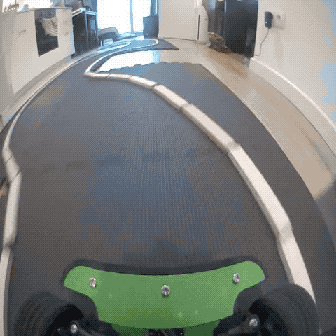
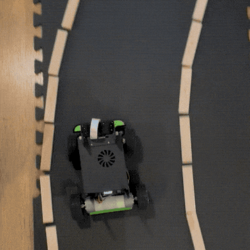
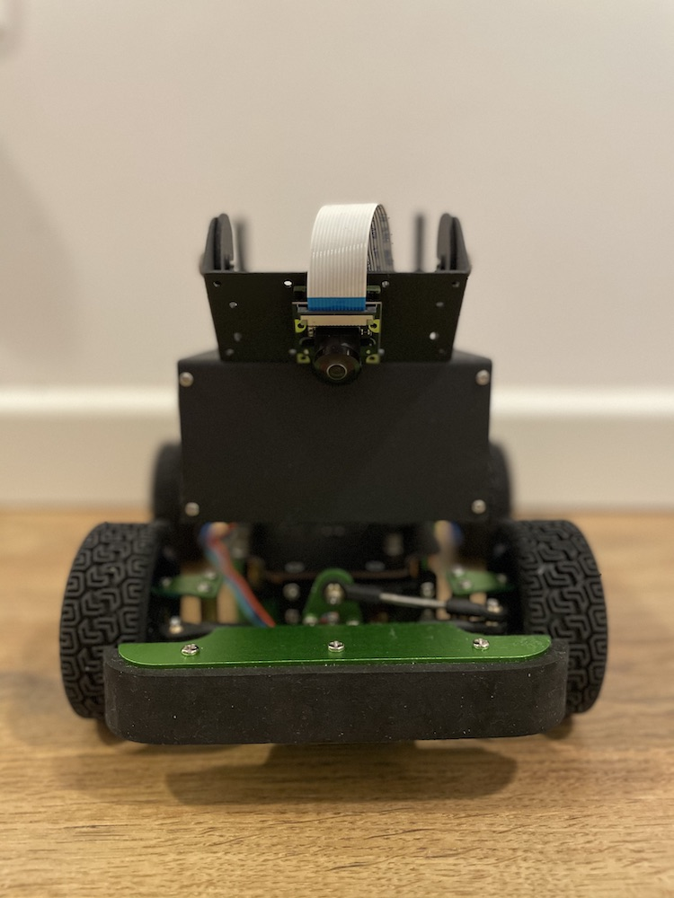
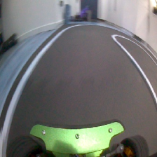
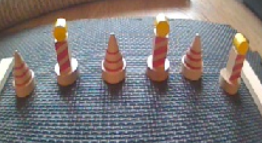
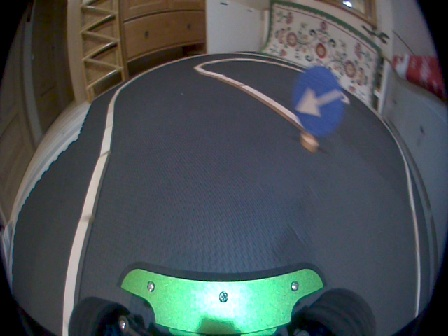
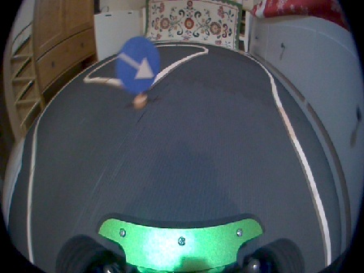

<h3 align="center">
  
</h3>

# Jetson

Jetson is a self-driving toy car project. It contains an end-to-end CNN vision system build in PyTorch.

Check the corresponding articles:
 
[Jetson - Self-Driving Toy Car (Part: 1) Car Assembly, System Design and Basic AI Autopilot Motion](https://medium.com/@gsurma/jetson-self-driving-toy-car-part-1-4341c139c0f2)
 
[Jetson - Self-Driving Toy Car (Part: 2) Computer Vision Sensing & CNN Perception Improvements](https://medium.com/@gsurma/jetson-self-driving-toy-car-part-2-983044dbfb3e)

## Capabilities

 
Path following

---
 
 

 
Stopping

---
 
 

 
Crossroads left turn

---
 
 

 
Crossroads right turn
 
 

## Hardware

Any RC Car chasis with controllable throttle (longitude) and steering (lateral) should be compatible. 

There is a bunch options to start with. I recommend checking [nvidia's suggestions](https://github.com/NVIDIA-AI-IOT/jetracer#cars), [donkey car docs](http://docs.donkeycar.com/guide/build_hardware/) or [waveshare AI kit](https://www.waveshare.com/wiki/JetRacer_AI_Kit) which is used in this project.

### Senors
* Front facing wide-angle camera with 200° FOV

### Brain
* Jetson Nano by NVIDIA

## Software

### Prerequisites
* [jetcard](https://github.com/NVIDIA-AI-IOT/jetcard)
* [jetcam](https://github.com/NVIDIA-AI-IOT/jetcam)
* [jetracer](https://github.com/NVIDIA-AI-IOT/jetracer)
* [torch2trt](https://github.com/NVIDIA-AI-IOT/torch2trt)

*when using waveshare's kit, you might need to use waveshare's forks of the above repos, see [link](https://www.waveshare.com/wiki/JetRacer_AI_Kit)

### 1. Data Collection
[Notebook](autopilot_data_collection.ipynb)
 
 
The main goal of this stage is to gather data reflecting correct driving, i.e images with correctly annotated steering and throttle values.
While driving with the gamepad, you can record camera frames and corresponding steering and throttle values. An example piece of data may look as follows:
 

 
[0.1, 0.5]

Where the first value is a steering value and the second one is a throttle value. Both of them range from -1.0 to 1.0.

Also, Jetson is capable of learning to stop when encountering the end of the road, for example when seeing the following cones:

Or taking appropriate crossroads turns.
 

___

I recommend collecting at least 20k of samples, but usually the more the merrier. Jetson was trained on ~60k and validated on ~20k.

### 2. Training

[Notebook](autopilot_training.ipynb)
 
 
Training process consists of iterating over previously gathered datasets and feeding them into the CNN. I recommend offloading data from Jetson Nano and performing training on the GPU as the process might be heavy on the resources and take multiple hours/days.

CNN network is built of the resnet18 backbone and a stack of dropout and fully connected layers.

    self.network = torchvision.models.resnet18(pretrained=pretrained)
    self.network.fc = torch.nn.Sequential(
        torch.nn.Dropout(p=DROPOUT_PROB),
        torch.nn.Linear(in_features=self.network.fc.in_features, out_features=128),
        torch.nn.Dropout(p=DROPOUT_PROB),
        torch.nn.Linear(in_features=128, out_features=64),
        torch.nn.Dropout(p=DROPOUT_PROB),
        torch.nn.Linear(in_features=64, out_features=OUTPUT_SIZE)
    )

Finally, we can check the model against the test set before we proceed to the real-world testing.
 

 
etc.

### 3. Testing
[Python script](autopilot_testing.py)
 
 
Finally, with the trained model we can test Jetson on the track. With the relatively lightweight CNN, Jetson operates at ~30 FPS, successfully drives the track in both directions and correctly stops at the end of the road.

___

And takes correct crossroads turns.
 

#### Performance Tips
* make sure that your compute unit operates at the max performance, for jetson nano run `sudo nvpmodel -m 0 && sudo jetson_clocks
`
* don't run the control loop from the jupyter notebook, use a python script to lower latency
* limit the number of operations performed in the control loop
* use [Tensor RT](https://developer.nvidia.com/tensorrt) for faster inference
* set your model to FP16 or even INT8 if possible

## Author

**Greg (Grzegorz) Surma**

[**PORTFOLIO**](https://gsurma.github.io)

[**GITHUB**](https://github.com/gsurma)

[**BLOG**](https://medium.com/@gsurma)

