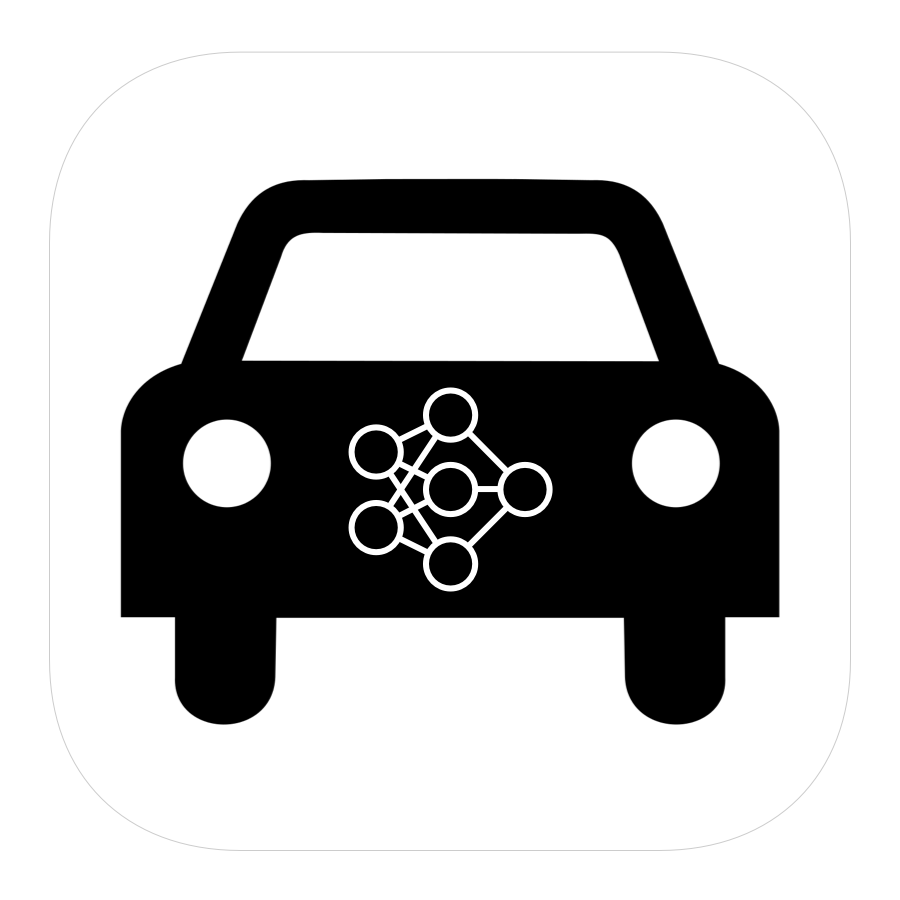
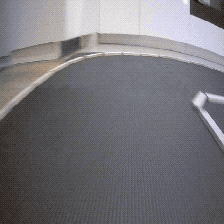
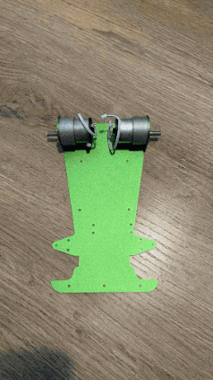
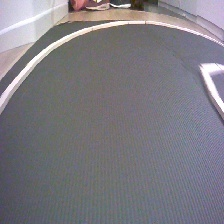
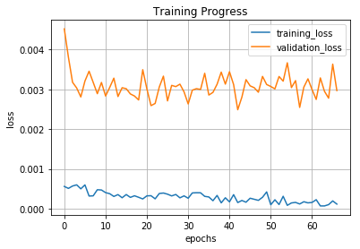

<h3 align="center">
  
</h3>

# Jetson

Jetson is a self-driving toy car project. It contains an end-to-end CNN system build in PyTorch.

## Hardware

Any RC Car chasis with controllable throttle (longitude) and steering (lateral) should be compatible. 

There is a bunch options to start with. I recommend checking [nvidia's suggestions](https://github.com/NVIDIA-AI-IOT/jetracer#cars), [donkey car docs](http://docs.donkeycar.com/guide/build_hardware/) or [waveshare AI kit](https://www.waveshare.com/wiki/JetRacer_AI_Kit) which is used in this project.

### Senors
* Front facing wide-angle camera with 160° FOV

### Brain
* Jetson Nano by NVIDIA

## Software

### Prerequisites
* [jetcard](https://github.com/NVIDIA-AI-IOT/jetcard)
* [jetcam](https://github.com/NVIDIA-AI-IOT/jetcam)
* [jetracer](https://github.com/NVIDIA-AI-IOT/jetracer)
* [torch2trt](https://github.com/NVIDIA-AI-IOT/torch2trt)

*when using waveshare's kit, you might need to use waveshare's forks of the above repos, see [link](https://www.waveshare.com/wiki/JetRacer_AI_Kit)

### 1. Data Collection
[Notebook](autopilot_data_collection.ipynb)
 
 
With the above notebook you can control jetson using a gamepad. The main goal of this stage is to gather data reflecting correct driving, i.e images with correctly annotated steering and throttle values.
While driving, you can record camera framea and corresponding steering and throttle values. An example piece of data may look as follows:
 

 
[0.3, 0.5]

Where the first value is steering value and the second one is a throttle value. Both of them range from -1.0 to 1.0.

I recommend collecting at least 20k of samples.

### 2. Training

[Notebook](autopilot_training.ipynb)
 
 
Training process consists of iterating over previously gathered datasets and feeding them into the CNN. I recommend offloading data from Jetson Nano and performing training on the GPU as the process might be heavy on the resources.

### 3. Testing
[Notebook](autopilot_testing.ipynb)
 
 
Finally, with the trained model we can test our jetson on track. With relatively lightweight resnet18 CNN jetson operates at ~30 FPS and successfully drives the track in both directions. 

## Author

**Greg (Grzegorz) Surma**

[**PORTFOLIO**](https://gsurma.github.io)

[**GITHUB**](https://github.com/gsurma)

[**BLOG**](https://medium.com/@gsurma)

